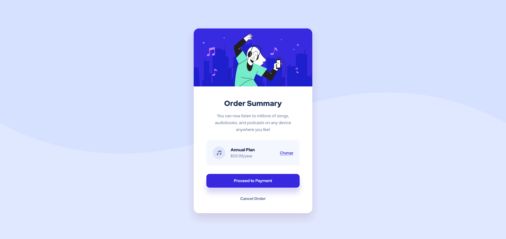

# Frontend Mentor - Order summary card

This is a solution to the [Order summary card challenge on Frontend Mentor](https://www.frontendmentor.io/challenges/order-summary-component-QlPmajDUj).  

## Table of contents

- [Overview](#overview)
  - [The challenge](#the-challenge)
  - [Screenshot](#screenshot)
  - [Links](#links)
- [My process](#my-process)
  - [Built with](#built-with)
  - [What I learned](#what-i-learned)
  - [Continued development](#continued-development)
- [Author](#author)

## Overview

### The challenge

Users should be able to:

- See hover states for interactive elements

### Screenshot



### Links

- Solution URL: [https://github.com/Henrydevlab/order-summary-component](https://github.com/Henrydevlab/order-summary-component)
- Live Site URL: [Add live site URL here](https://your-live-site-url.com)

## My process

### Built with

- Semantic HTML5 markup
- CSS custom properties
- Flexbox
- Mobile-first workflow

### What I learned

To match the pixel-perfect layout of the original design mockups exactly, I used a responsive line-breaking strategy inside the description paragraph to enforce precise word wrapping across viewports:

```html
<p class="card-description">
  You can now listen to millions of songs,<br class="m-none"> audiobooks, and podcasts on <br class="d-none">any <br class="m-none">device anywhere you like!
</p>
```
```css
/* Base Mobile Line-Break Helper Hiding Rules */
.m-none {
  display: none;
}

/* Base Mobile Line-Break Helper Showing Rules */
.d-none {
  display: inline;
}

/* Breakpoint Conditions For Desktop Rendering Breaks (Above 480px Wide) */
@media (min-width: 481px) {
  .m-none {
    display: inline;
  }
  .d-none {
    display: none;
  }
}
```
### Continued development

In future projects, I intend to continue exploring structural fluid typography techniques (using clamp()) combined with responsive utility breaks to ensure flawless layout compliance across all intermediate device viewport widths without relying on strict, hardcoded pixel values.

## Author

- Frontend Mentor - [@henrydevlab](https://www.frontendmentor.io/profile/henrydevlab)
- Twitter - [@henrydevlab](https://www.twitter.com/henrydevlab)
